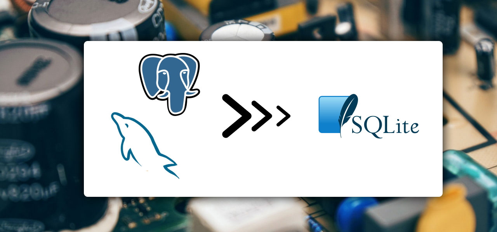
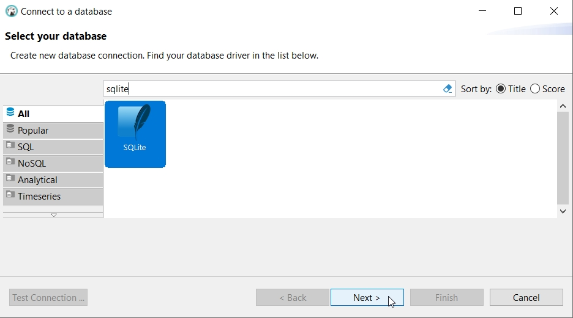
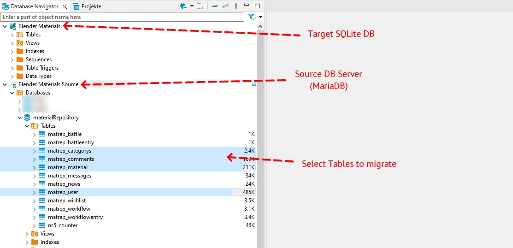
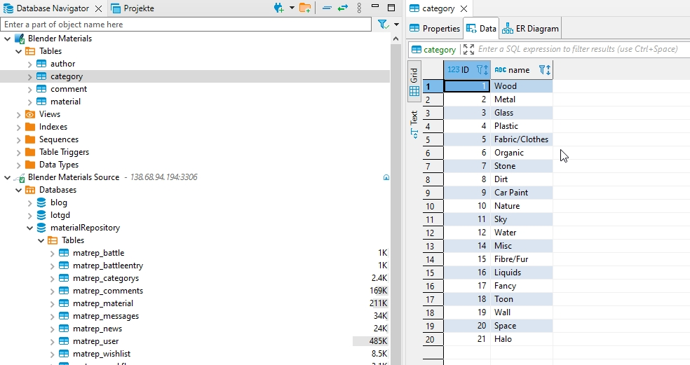

# Convert a MySQL or Postgres database to SQLite

I converted a couple of old PHP+MySQL Websites to static websites recently. The idea that an (old) PHP will query a database
upon each page request and will render the information to HTML _every single time_, even if nothing changed seems "silly" nowadays
in the wake of powerful static site generators.

I started to convert some old projects to save a bit on hosting and be more flexible in the future.

While static sites are a good thing which doesn't require a live database anymore, you still need your data at hand while you
generate your site. And if you make some changes to your templates, you need to re-generate again and will need the data again.

Since the goal of my move was to remove the hosted MySQL database, I got the idea to convert them to local SQLite databases, so I
can have my data in a file on my computer (or even my repository) and forget about it. No need to install and run a local MySQL or
Postgres server - not even in a docker container. My build process would simply query the SQLite database file directly when needed.

## DBeaver to the rescue
In case you don't know DBeaver yet, [install it now](https://dbeaver.io/). Its a free, opensource sql database client which can connect
to virtually any SQL database out there. Locally or remote (if you have arcane and god-forbidden tasks on a production database).

I knew before that there is an importer function in DBeaver but with a SQLite database, this leaves you with the option to import from a CSV file. Shucks.
I wanted to transfer the data directly from database to database.

It was a bit counter-intuitive (for me), but I finally found how to do it - you have to _export_ from your MySQL database and select the SQLite database
as a target.

## Step by step

### 01: Create your SQLite connection
At first, you need a SQLite database as your receiving target. If you already have such a file and just want to move a couple of additional tables
into it - great! If not, just create an empty file inside your project folder and name it something like `db.sqlite3` - you can pick whatever
file extension you like - I thought `sqlite3` was appropriate.

Now you need to add the SQLite database in DBeaver. Click on on the little plug icon with the plus, labelled `"New Database Connection""`.

In the connection window, search for SQLite and continue.

Next, you select the database file you already have or created before and click `"Finish"`.

### 02: Connect to your MySQL or Postgres Database
If you don't already have your "big" database in DBeaver, follow basically the same steps
as with the SQLite database but pick your database type and enter your login credencials,
maybe also with an SSL tunnel. 

> I wrote an article before about having auth problems when connecting to a MySQL server over SSH.
> Read about it, here: [Access denied for 'root'@'localhost'](/access-denied-for-root-at-localhost/)

### 03: Select which tables to migrate
Now you have both your SQLite and your original database in your database navigator.

Open the `"Tables"` folder of your source database and select the tables you want to migrate
using `CTRL+CLICK` and/or `SHIFT+CLICK`.

After you selected all necessary tables (in my case, not all tables were necessary), do a `RIGHT-CLICK` on your selection and choose
`"Export Data"`.

A `"Data Transfer"` window will open with the option `"Database"` preselected - just click `"Next"`.

### 04: Apply a table mapping
In the next window, you can decide if you want to rename the tables you want to migrate in any way.
I chose to rename them because I preferred a simpler naming.

To rename a table in your SQLite database, `DOUBLE-CLICK` on the cell in the `"Target"` column.

If you are done, click `"Next"`.

### 05: Optionally provide some migration settings
In my case, no changes were necessary in the next two steps of the `"Data Transfer"` dialog.

I left the points `"Extraction settings"` and `"Data load settings"` as they were and finally
hit `"Proceed"` on the conclusionary `"Confirm"` page. After a couple of seconds, all my data 
had been transferred to my SQLite database.

### 06: All done
As you can see: all data has been transferred from my MySQL (MariaDB) database
to my local SQLite file. In my case, I was now able to create a static website
for the data and shut down the previous hosting completely.

