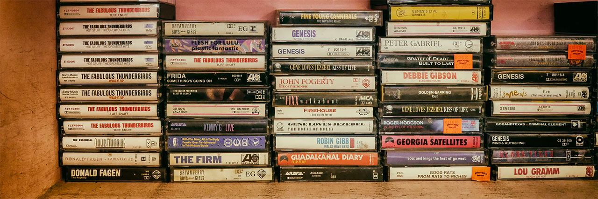
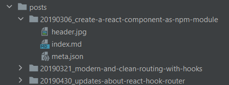

# The new old school



Hello World. Again.

This blog was offline now for some time, since that day where I wanted to update my instance of [ghost](https://ghost.org) and was unable
to do so. I don't remember exactly what went wrong that day but I messed it up completely. But I wasn't sad about shutting it
down, since ghost turned out to be really complicated to handle. Nothing comparable to its ancestor wordpress and not at all
as flexible. Everything had to be done through the ghost CLI on the server. But not with your standard linux user, no no.
And I just wanted to write some blog posts.

For the new version of the blog I wanted to have a static site again. Good, old, humble, static html. There was a lot of buzz
at the SSG front in the recent years. Many developers realized that client side rendered react pages are not the best idea of
the day and invented things like [gatsby](https://www.gatsbyjs.com/) or [next](https://nextjs.org/) to regain a bit of sanity.

I work with react a lot in my daily job and since I like the component based approach in building complex applications with it,
using it for simple - mostly static - websites still feels like using the wrong tool for that job.

I wanted something simple. Write markdown, put it in folders and have it rendered to HTML, using some simple templates.

I am a javascript guy, so I wanted to stay in my comfort zone - even without react. There are other approaches out there 
like [11ty](https://www.11ty.dev/) which promises to be simpler. Nice!

But after trying to understand how it works for over half an hour, my mind told me: "hey. I know you are old now and don't
want to re-invent the wheel like a teenager anymore, but... markdown, template, a bit of styling. Can't be that hard to glue
together on your own."

## Lets re-invent the wheel

It went surprisingly well. It took me about [a hundred lines of javascript](https://github.com/Paratron/parastudios/blob/master/build.js) to write a node
script that generates this blog. I wrote my templates in plain javascript template literals. The styling is written in
scss. The result is hosted on github pages - and I am not even a friend of the serverless movement.

I hosted the whole thing [on github](https://github.com/Paratron/parastudios), feel free to look into it and copy my sources as needed. 

## File structure

A simple website does not need a lot of things - still a good file structure helps a lot in keeping things organized. 

### Global assets

I have an `assets` folder with global files like the styling, the favicon or the site logo that is needed everywhere. The build script
copies its contents over into the dist folder as is. Not much magic here. I have a sass file for my styling that is converted
to css by using [sass](https://www.npmjs.com/package/sass). I created a npm script that executes the css build and am running it automatically using an [IntelliJ file watcher](https://www.jetbrains.com/help/webstorm/using-file-watchers.html).

### The post folders



I am creating a sub folder per post in my posts folder. Prefix the folder names with a numeric date in the format `YYYYMMDD` to 
have them sorted by date. Inside those post folders goes everything that belongs to the post. The `index.md` contains the
text. Any images or other files you want to reference go there as well. At last, there is also a `meta.json` file that defines
a bit of additional data used during the processing:

```json
{
  "title": "Some example",
  "slug": "some-example",
  "publishTime": "2020-01-01 15:42:31",
  "description": "This is an example post to show you how it works",
  "tags": ["npm", "babel", "webpack", "javascript", "webdev"]
}
``` 

The `slug` is of particular interest, since this is the URL the post will go live. This way you can organize the posts in a different
way than your working files. The meta object is passed directly to the template files so I can use the information there. At the moment I
 am not using the tags, but plan on using them to create topic index pages, soon.

The build script creates a folder named `some-example` inside the dist folder (based on the slug). All contents of the post folder
will be copied into the dist folder as well. This way all assets like images can be referenced relatively. The `index.md` file will
be compiled into an `index.html` file and put into that folder as well (more info below). In the end, the post can be accessed by loading `/some-example/index.html` 
or just `/some-example/`.

### Views (templates)

The `views` folder contains several javascript files with template literals to generate the result pages. The page frame generates
the skeleton around each page, with meta tags and "global" functionality like the dark mode toggle.

There is no general rule of thumb on how to structure your templates. I would advise to split your templates into multiple functions
whose name describe what they do. This way you can reference other template parts by calling their function names in place: `${githubProfile()}`
tells you exactly what will be rendered here without having you read the source. 

## Converting the markdown

I installed [marked](https://www.npmjs.com/package/marked) as a dependency for converting markdown to html. It is loaded by the build script and extended/reconfigured 
in some places. For example, I wanted my code examples to be highlighted at build time, so I am loading the [highlight.js](https://www.npmjs.com/package/highlight.js) module
and make marked using it.

Another notable feature is that marked allows you to use the lexer directly, so you can access the markdown document as an object.
I wanted to have a little navigation on my post pages where you can jump immediately to the individual headlines - this is a rather
simple task when you have the document object at hand.

Marked is also flexible enough to overwrite its internal templates for handling certain markdown artifacts - so I overwrote the
template for rendering headlines to add anchors to them (hover over a headline on a desktop to see it). Thats also necessary for the in-post
navigation.

## Index pages and rss feed

The build script reads the whole `posts` folder, loads all the `meta.json` files inside and adds it to a big array. This is
being forwarded to the templates for my index page, and the rss feed. Based on the meta information, its easy to generate pages
that list all my posts. For my landing page, I also created a separate template that displays my github profile data (fetched from the GH api)
alongside the blog list.

## Dark mode
This is my first website that uses a dark mode feature. I learned some time ago that it is possible to make a page react to the
preferences a user has set in their operating system and create a media query for dark mode!

Alongside with css custom variables, this gives a lot of flexibility.

```css
:root{
    --textColor: #333;
}

@media (prefers-color-scheme: dark) {
    :root{
        --textColor: #fff;
    }
}

body{
    color: var(--textColor);
}
```

## Hosting on Github Pages

Until now, I hosted every website or app I made on a "bare metal" server. Setting up a virtual machine with ubuntu and apache
went straight into my DNA after working with servers for years. I previously used github pages for publishing instances of [Storybook](https://storybook.js.org/)
in work projects and wanted to try out if its easier to use that than configuring apache to serve another site and add an SSL cert to it.

Turns out, it really is. You switch the pages option on in your project and can even assign a custom domain to it. https is also just a
checkbox to be enabled.

The only "downside" here is that you have to have your project to be public when you want to use github pages, or you need to pay
for a private repo being served over github pages. Since I am writing this blog to provide information for others to learn from,
I don't see a problem in hosting it on github publicly.

If you have particular questions or some comments, feel free to [send me a tweet](https://twitter.com/intent/tweet?screen_name=paratron). 
