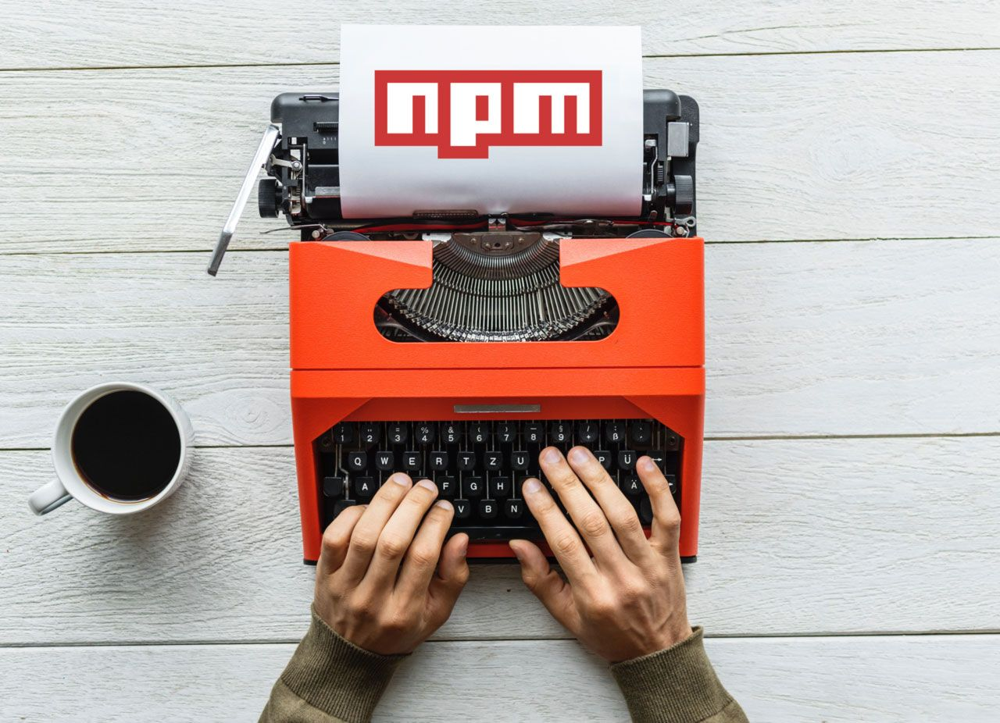

# Create a react component as npm module



There are a lot of guides out there that advise you to use webpack to wrap up
your components before publishing them to npm. This is absolutely not necessary.
I would even consider it bad practice. Its much easier without webpack, too.

Lets say we have created a component, or even better - a collection of
components that we want to re-use in other projects. In this case, we would move
the components into a separate project and publish that project on npm. Lets do
that.

## The basic setup

First, create a separate project
We create an empty folder anywhere where we want to have our project located and
call `npm init` inside.

npm asks a couple of questions about the project and we end up with a 
`package.json` file inside the project folder.

## Code structure

I would advise to create a subfolder `/src` inside our project folder so we have
a place where our component source files can live that is not littered with
config files or readme files. So we create this subfolder and move our component
source(s) in there.

Inside the `/src`  directory, create an `index.js` file that will be the entry point
of your module. It should import all your components and export them again. For
example like this:

```jsx
import Component1 from './Component1';
import Component2 from './Component2';
import Component3 from './Component3';

export {
    Component1,
    Component2,
    Component3
};
```

The reason for this is that somebody who uses your module can import your
components like this:

```jsx
import {Component1, Component3} from 'myExampleModule';
```

## Install react as dev dependency

You certainly want to put additional work into your project and tweak your
components - especially IDEs will go easier on you, if you have react installed
in your project. You should install react with the `--save-dev` flag so it will
be listed as `devDependency` and not as regular dependency. This way react is
only installed for you while working on the project, but not when someone
installs your module into their app. We will set an option later in this post
that your module will actually consume the react instance that is used by the
parent application. 

## Babel comes into play - but why?

You need to know something about npm modules: There is a convention that all
code inside `node_modules` should be converted down to ES5. ES6+ code may not run
on some browsers or some versions of node. Also, when you are developing a react
application with `create-react-app` or a custom configured webpack+babel combo,
the default behavior of webpack is that only source files outside of 
`node_modules` will be passed to babel. Other code remains untouched (because of
that convention I mentioned). So if there is actually a npm module containing
ES6+ or JSX, your build will fail.

## Installing and configuring babel

So before we publish on npm, we need to convert our sources. Lets install babel
for that:

```
npm install --save-dev @babel/core @babel/cli @babel/preset-env @babel/preset-react
```

Okay, that was actually 5 packages instead of "just babel", so lets explain that
one by one:

`@babel/core` - This is actually babel. We don't want to use babel inside
some node scripts but from the command line, so we also need `@babel/cli`. I am
pretty sure you want to use ES6+ features of javascript so its recommendable
that we install `@babel/preset-env` which teaches babel about modern javascript
features. We are working with react components which are most probably written
in JSX, so we need to "teach" babel to understand JSX and how react stuff works.
Thats coming from `@babel/preset-react`. 

Phew. We're almost there. Now, we need to create a babel config, so babel knows
which presets to use. Create a file named `babel.config.js` in your project root
and give it the following content:

```jsx
module.exports = function (api) {
	api.cache(true);

	const presets = [ "@babel/preset-env", "@babel/preset-react" ];
	const plugins = [ ];

	return {
		presets,
		plugins
	};
};
```

This tells babel to use those two presets we installed before and that
we do not use any special plugins right now.

## The build script

Now we need a command that converts our sources before they are published to
npm. Open your `package.json` and add the key `prepublishOnly` to the scripts 
object:

```json
"scripts": {
    "prepublishOnly": "babel ./src --out-dir ./dist -s inline"
},
```

Okay, what does this do? It calls babel from the command line and tells it:
"Please convert everything inside `./src` into the output folder `./dist`. Also
please create sourcemaps (-s) and inline  them into the javascript files.

If you execute now `npm run prepublishOnly`, a `/dist` folder will appear inside
your project containing the converted files. Jay! I highly recommend adding this
folder to your `.gitignore` file - you don't need it in your repository.

Why is the script named `prepublishOnly`? Thats a "magic keyword" for npm. This
script will be called automatically whenever you are going to publish anything
online on npm. So you cannot forget your compile step 😁

## React as shared dependency

It is especially frustrating if you use react hooks and forget to add react as a
peer dependency. If you mention react as normal dependency, your npm module will
receive its own, separate copy of react that is not shared with the
application that will consume your module in the end. Hooks for example cannot
work in this case.

Set react as `peerDependency` in your `package.json` like this:

```json
"peerDependencies": {
    "react": "^16.8.0"
},
```

Copy the react entry from your `devDependencies` field to `peerDependencies`.
Also, don't be too strict, here. If you use Hooks, you need at least react 
`16.8.0` - if not, an older version of react might be fine. The `^` at the
beginning of the version number means "anything from here or above". This is
important since the applications that will consume your module might use wildly
different versions of react. And since your module and the parent app will share
the same instance of react, you need to be as compatible as possible.

## Last preparations to your package.json

We want to tell npm exactly which files are going to be published, since only
the contents of the `/dist` folder are necessary for anyone installing our
component(s). For this purpose, you can add a file  property to your 
`package.json` containing a list of files and/or folders to publish (the
package.json is always included in the published files - read more in the [npm
help](https://docs.npmjs.com/files/package.json#files). 

```json
"files": [
    "dist/*"
],
```

The little star behind the folder name is a [glob pattern](https://en.wikipedia.org/wiki/Glob_(programming)), 
telling npm "everything inside dist".

So last but not least we need to define an entry point for our module, since
when we publish the module as `exampleModule` and someone imports or requires
this module, npm needs to know which javascript file inside our module is the
actual "default" file. 

Remember the `index.js` file you created in `/src` before? This file has also been
moved to `/dist` and should work as our module index file. So we add it
explicitly as entry point to the package.json:

```json
"main": "dist/index.js",
```

## Now lets publish

I will not cover how you create an account on npmjs.com and login to that
account in the command line. I assume you already did that. I also assume you
looked up that the name of your module was not yet taken and chose a unique
name. All you need to do now is calling `npm publish`.

Keep in mind that when you make changes to your project and want to publish them
again, you need to update the version  field in your `package.json` according to 
[semver](https://semver.org/). If you don't change the version, you cannot
publish again.
