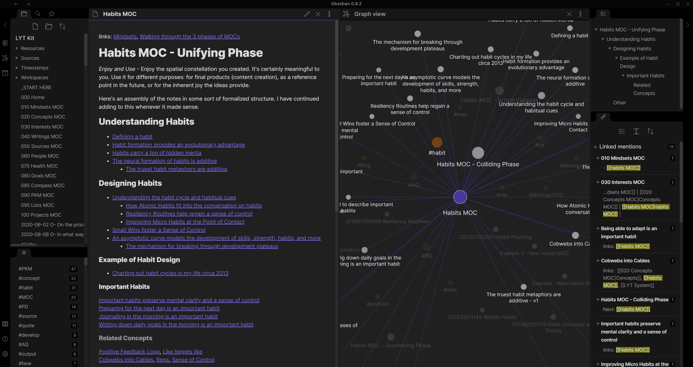

# Introducing and using Obsidian

I recently stumbled across an open source app I never heard before: [Obsidian](https://obsidian.md)

Its an app for writing and organizing markdown text documents. While this does not sound like much, it changed my work life a lot and gave me such a positive impact that I wrote this post to share the app with you.

### My struggle with taking notes

I read and learned about the art of note-taking before. I know that some sophisticated people keep huge collections of notes, thoughts and pieces of wisdom - for example in systems like the Zettelkasten of XXX or the infamous collection of notes about people by [That investment guy].

While I always kept a classic note book in paper form near me, I only rarely used it. I am a very digital person - always working on lots of projects. Either for my employee or for myself. A note book is a linear medium. You fill page by page untill there is no more space. But my thoughts wander around. I sketch out an idea halfway through, then work on something else. Or I add more information to some topic later on. Thats difficult with a book. I always tried to leave some pages blank between unrelated topics, but it always gave me a feeling of limited space to express my thoughts. Also its not searchable. And not linkable. And I can't use it in the dark.

### What makes obsidian valuable
The obsidian app is being installed on your device - be it a Windows, Mac or Linux desktop or an Android or iOS device - it works anywhere.

It creates a local folder with text files in it. Completely offline and completely yours. No cloud used, no account needed.

The texts can be formatted with markdown - complete with links and images.

You can go ahead and add or edit the text files in the folder with any other text editor.

It formats code blocks with beautiful syntax highlighting.

It can export your formatted texts as PDFs.

Writing texts in dark mode on my mobile is pure bliss.

### On steroids with device sync
The app itself offers a paid sync feature for $4/mo (as the time of this writing). Since the app writes plain text to a folder on your device, you get some other options tough.

I went ahead with [Syncthing], an open source file sync tool for Windows, MacOS, Linux and Android. Since it also works without a cloud or an account, it was the perfect solution for me. Apps like Dropbox or Google Drive dont sync a folder on your mobile and dont work in this case.

Setting it up on android was a bit tricky because of the security constraints but I eventually figured out how to make it work: the "Documents" Folder on my android device can be read/write accessed by any app with permission, so I set the Obsidian Vault location there. I then shared the vault folder through syncthing with my laptop.

Now, whenever I take notes on my mobile, I can pick them up on my laptop. Or when I write down extensive research on my laptop, I can browse and search it on my mobile when I'm on the run.

And since everything is markdown based, I even wrote this blog post in Obsidian. What a great and truly open piece of software!

I just started using obsidian in my everyday work and it already had a big impact on my workflow. I strongly suggest you to give it a try.
