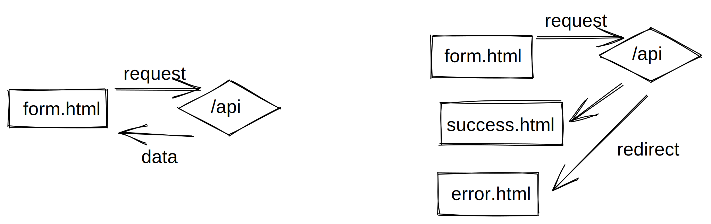

# The Redirect Response pattern


Chances are high that you've worked with an HTTP-based API before. You make a request against the API - be it via GET, POST or something else and you get a pure data response. Mostly JSON or maybe XML.

I guess the majority of web developers have interacted with such APIs in the past - maybe even implemented one themselves.

I created a pattern where the API (optionally) does not respond with data directly, but with HTTP redirect "callbacks". I found this pattern useful when working with static websites that still need a contact form so I want to present the pattern here.

### HTTP callbacks?
The concept of callback functions is very common in asynchronous Javascript calls. Functions get passed as arguments to other functions and they will be called whenever the result (or an error) is available.

I applied this concept to my API calls. Lets have an example:

Say, I have an API endpoint that takes a message and an email address of a contact form and processes it.

`https://example.com/contact`

Most APIs would take the request, process it and return data and a status code that indicates if the request was successful or has failed. This could be a HTTP 200 and a message like "ok". Or maybe a HTTP 400 with the message "invalid mail".

Now, when the contact form should be processed, the submit event could be intercepted, the request sent via AJAX and the response interpreted in Javascript. By using the Redirect Response pattern, some Javascript boilerplate can be cut out here. Lets apply the pattern.

### The pattern
We tell the API that after processing the request, it should redirect the browser to a different URL:

`https://example.com/contact?onSuccess=/thankYou.html&onError=/contact.html`

I put exactly this URL into the `action` attribute of my contact form:

```html
<form method="post" action="https://example.com/contact?onSuccess=/thankYou.html&onError=/contactError.html">
....
</form>
```

I defined two "HTTP callbacks", here: `onSuccess` should be called, when everything went fine. The `onError` callback is being called when the processing fails.

Instead of returning data, the API returns a [HTTP 303 statuscode](https://developer.mozilla.org/en-US/docs/Web/HTTP/Status/303~~~~) and redirects to the provided URL.

This way, no javascript is needed to process the contact form. The validation can be done through [HTML5 form validation](https://developer.mozilla.org/en-US/docs/Learn/Forms/Form_validation#using_built-in_form_validation). If everything seems valid, the form data is being sent to the API (the browser tries to navigate to the API endpoint), processed and then, the API issues a redirect. Either to the thank-you-page, or the error-page. Look ma, no Javascript! Just plain HTML files.

### Passing and processing result data
Sometimes, just sending the user along to other pages is not enough. You may want to react somehow to the response data from the API. Maybe just providing a general error page when lots of small errors could happen is considered bad UX. I hear you.

In cases like this, I extend the pattern a bit. The server redirects and appends additional data in a query string. So instead of redirecting to `contactError.html`, it can redirect like this: `contactError.html?error=invalidMail`.

This way, the error page can access details about what went wrong and provide additional information.

With lots of response data, the solution gets hairy, tough. When you serialize big objects, the URLs get pretty long, quickly. Also be careful with sensible data - it might end up in your server logs and will be plainly visible in the users URL bar. On the other hand, it might be easy to fetch how often error pages are called and what error happened directly from your plain server logs. No Analytics software needed.

### Conclusion
Additional layers and features can be implemented here to create variations of the basic pattern:

- You may want to check if the referrer is allowed calling the API
- The query parameters `onSuccess` and `onError` are just an example. Other names work, too.
- Maybe the `onError` can be optional and the API redirects to the other endpoint in any case, when `onError` is omitted.
- The `onSuccess` redirect could receive result data, too
- Data could only be passed along when the parameter is named `onErrorWithData` - otherwise its assumed the refirected page does not need the data
- The API could respond with plain data as usual if all `onXXX` parameters are omitted.

I hope I was able to give an idea of how the pattern works and what benefits and drawbacks emerge from using it.
