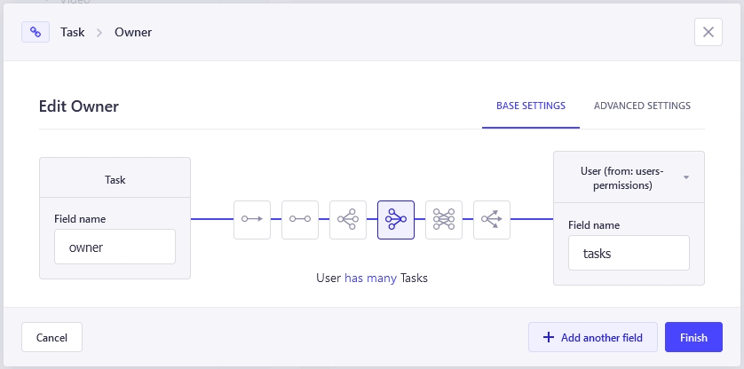

# Limit access of Strapi users to their own entries

This was actually one of the first problems I encountered when I began using Strapi version 4 as a backend boilerplate for my [streaming service for steam broadcasts](https://robostreamer.com) side project.

What I wanted was that when a user requested a list of or a certain entity, the backend should only respond with entities which belong to the user. By default, Strapi would send all entities from everyone.

Lets say you create a TODO app with a `/tasks` endpoint. Each user should be able to create tasks by doing `POST` requests but if they do a `GET` request to `/tasks` they should _not_ see everyones tasks. Also `PUT` requests should only work when the given task belongs to the user.

So how do we achieve this?

> __tl;dr__    
> Use a service call in the `create()` method to set the `owner` field with system privileges.
> Force a filter to the id of the current user in all other methods.

## Extend the Strapi controller
Lets stay with the `tasks` example for this article. The moment you create that data type through the Strapi Content-Type Builder, Strapi will create a dummy controller in `/src/api/task/controllers/task.js`.

The content will look like this:

```javascript
'use strict';

/**
 *  task controller
 */

const { createCoreController } = require('@strapi/strapi').factories;

module.exports = createCoreController('api::task.task');

```

In order to get the behavior we want to achieve, we need to roll our own `find()`, `findOne()`, `update()` and `delete()` methods to limit the access. The `create()` route needs to be defined as well, since - as far as I know - Strapi is unable to link the current user to an entry automatically.

So lets begin with saving the creator of a task in its own field. I added a new field in the Strapi Content-Type Builder which is a relation to the users table. Yes, Strapi will keep track of the user which was the creator of an entry but this is not editable. If you as an administrator create a task for a user in the admin interface, your name will be set as the creator and you can't do anything to change that. So we create a "real field" on the entry.



### The `create()` method

Now lets update the `task` controller so upon creation the `owner` field will be set to the id of the user which issued the request.

```javascript
'use strict';

/**
 *  task controller
 */

const { createCoreController } = require('@strapi/strapi').factories;

module.exports = createCoreController('api::task.task', {
    
    async create(ctx) {
        const user = ctx.state.user;

        const task = await super.create(ctx);

        const updated = await strapi.entityService.update("api::task.task", task.data.id, {
            data: {
                owner: user.id
            }
        });

        return result;
    },
    
});

```

With this code in place - whenever a user creates a new task via http `POST`, the controller will read the user object from the request state (a bit like a session), create a task and then immediately update it by setting the owner field to the user id.

#### Why the two step process?
The immediate thought I would have when reading the above code would be: why not sneaking the owner id into the payload that is passed to `super.create()` and avoiding the separete call to `update()`?

Well, the reason is that this will only work when the issuing user has access to modify the `users` table. If not, there is no way Strapi will let you set that value. So by calling `super.create(ctx)` first, we make sure the task entry is created in the name of the user.

Our next call to `strapi.entityService.update()` is done with system privileges, tough. The action is not related to a user so no permissions will be checked. The owner field will be set with super admin privileges (so be _extra careful_ when doing this).

> __Heads up!__    
> The automatic owner assignment will _not work_ when you create tasks inside the admin interface. Controller methods are only being called when requests are made through the public REST or GraphQL api.

### The `find()` method
When the tasks application issues a `GET` request to `/tasks`, Strapi will return a list of _all_ existing tasks, of _all_ users. To prevent that, we need to forcefully add a filter to the query.

```javascript
async find(ctx){
    const user = ctx.state.user;
    
    ctx.query.filters = {
        ...(ctx.query.filters || {}),
        owner: user.id
    };
    
    return super.find(ctx);
}
```

Again, we get the current user object from the request state. Then we update the `filters` property of the `query` object for the request. We copy over all filters which have been passed by the user, then we set the `owner` field to the current users `id`. This way, the filter is always set serverside, even if the user would pass in a forged `owner` parameter from the outside. It would not be possible to request tasks of a different user.

### The other methods

Since wrapping the other methods in the same filter is basically copy/paste, I will put them all together, here:

```javascript
async findOne(ctx){
    const user = ctx.state.user;
    
    ctx.query.filters = {
        ...(ctx.query.filters || {}),
        owner: user.id
    };
    
    return super.findOne(ctx);
},
async update(ctx){
    const user = ctx.state.user;

    ctx.query.filters = {
        ...(ctx.query.filters || {}),
        owner: user.id
    };

    return super.update(ctx);
},
async delete(ctx){
    const user = ctx.state.user;
    
    ctx.query.filters = {
        ...(ctx.query.filters || {}),
        owner: user.id
    };
    
    return super.delete(ctx);
}
```

You may want to DRY your code a bit, but I actually copy/pasted the parts for real to be able to make other customizations more quickly.
